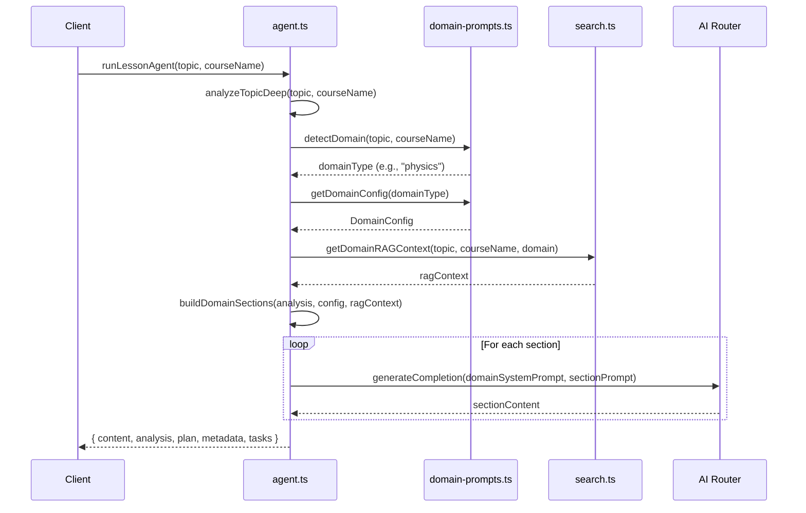

# Design Document: Domain-Specific Theory Generation

## Overview

Интеграция доменно-специфичных промптов из `domain-prompts.ts` в основной генератор теории `agent.ts` для улучшения качества и структуры генерируемого контента. Текущая реализация использует generic промпты с базовой логикой определения типа темы, в то время как `domain-prompts.ts` содержит детальные конфигурации для 13 доменов, которые не используются.

### Текущая архитектура

```
agent.ts                          domain-prompts.ts
┌─────────────────────┐          ┌─────────────────────┐
│ runLessonAgent()    │          │ DomainConfig        │
│   ↓                 │          │ - systemPrompt      │
│ analyzeTopicDeep()  │          │ - sectionTemplates  │
│   ↓                 │          │ - formatRules       │
│ buildCourseStructure│          │ - examplePatterns   │
│   ↓                 │          │                     │
│ buildDynamicSections│ ──✗──→   │ detectDomain()      │
│ (generic prompts)   │          │ getDomainConfig()   │
│   ↓                 │          └─────────────────────┘
│ generateFullLesson  │
└─────────────────────┘
```

### Целевая архитектура

```
agent.ts                          domain-prompts.ts
┌─────────────────────┐          ┌─────────────────────┐
│ runLessonAgent()    │          │ DomainConfig        │
│   ↓                 │          │ - systemPrompt      │
│ analyzeTopicDeep()  │          │ - sectionTemplates  │
│   ↓                 │          │ - formatRules       │
│ detectDomain() ─────┼──────────┼→ detectDomain()     │
│   ↓                 │          │                     │
│ getDomainConfig() ──┼──────────┼→ getDomainConfig()  │
│   ↓                 │          └─────────────────────┘
│ buildDomainSections │
│ (domain-specific)   │
│   ↓                 │
│ generateFullLesson  │
│ (with domain prompt)│
└─────────────────────┘
```

## Architecture

### Компоненты

1. **Domain Detector** (`domain-prompts.ts`)
   - Функция `detectDomain(topic, courseName)` — определяет домен по ключевым словам
   - Возвращает один из 13 типов: physics, math, chemistry, programming, biology, history, economics, languages, psychology, law, medicine, art, general

2. **Domain Config Provider** (`domain-prompts.ts`)
   - Функция `getDomainConfig(domain)` — возвращает конфигурацию домена
   - Содержит `systemPrompt`, `sectionTemplates`, `formatRules`, `examplePatterns`

3. **Domain Section Builder** (новая функция в `agent.ts`)
   - Функция `buildDomainSections(analysis, domainConfig, ragContext)` — строит секции на основе шаблонов домена
   - Заменяет текущую `buildDynamicSections()`

4. **Domain Content Generator** (модификация в `agent.ts`)
   - Модифицированная `generateFullLessonContent()` — использует `systemPrompt` из домена
   - Применяет `formatRules` к промптам

### Поток данных



## Components and Interfaces

### Новые/модифицированные функции

```typescript
// В agent.ts

/**
 * Строит секции на основе доменной конфигурации
 */
function buildDomainSections(
  analysis: TopicAnalysis,
  domainConfig: DomainConfig,
  ragContext: string
): { title: string; prompt: string; minWords: number }[]

/**
 * Модифицированная генерация контента с доменным промптом
 */
async function generateFullLessonContent(
  analysis: TopicAnalysis,
  structure: CourseStructure,
  ragContext: string,
  domainConfig: DomainConfig  // новый параметр
): Promise<string>

/**
 * Применяет правила форматирования домена к промпту
 */
function applyFormatRules(
  basePrompt: string,
  formatRules: string[]
): string
```

### Интерфейсы (существующие в domain-prompts.ts)

```typescript
interface DomainConfig {
  type: DomainType
  name: string
  keywords: string[]
  systemPrompt: string
  sectionTemplates: SectionTemplate[]
  formatRules: string[]
  examplePatterns: string[]
}

interface SectionTemplate {
  title: string
  prompt: string
  minWords: number
  required: boolean
}
```

## Data Models

Существующие модели не изменяются. Используются:

- `TopicAnalysis` — результат анализа темы
- `CourseStructure` — структура курса
- `DomainConfig` — конфигурация домена
- `SectionTemplate` — шаблон секции

## Correctness Properties

*A property is a characteristic or behavior that should hold true across all valid executions of a system—essentially, a formal statement about what the system should do. Properties serve as the bridge between human-readable specifications and machine-verifiable correctness guarantees.*

### Property 1: Domain Detection Consistency

*For any* topic string and course name, `detectDomain()` SHALL return a valid `DomainType` and `getDomainConfig()` SHALL return a config with matching `type` field.

**Validates: Requirements 1.1, 1.2**

### Property 2: Required Sections Presence

*For any* domain config with `sectionTemplates`, all templates marked `required: true` SHALL have corresponding sections in the generated content (matched by title).

**Validates: Requirements 1.4, 5.2**

### Property 3: Minimum Content Length

*For any* generated section, the word count SHALL be greater than or equal to the `minWords` specified in the corresponding `SectionTemplate`.

**Validates: Requirements 5.1**

### Property 4: Formatting Elements Presence

*For any* generated content, it SHALL contain markdown formatting elements: headers (###), lists (- or 1.), separators (---), and bold text (**).

**Validates: Requirements 4.1, 4.3, 4.4, 4.5**

### Property 5: No LaTeX in Output

*For any* generated content, it SHALL NOT contain LaTeX syntax patterns ($...$ or \frac, \sqrt, \lim).

**Validates: Requirements 2.4**

### Property 6: Code Blocks for Programming

*For any* content generated for programming domain, it SHALL contain code blocks (```language) and SHALL NOT contain pseudo-formulas like "Класс = (".

**Validates: Requirements 3.1, 3.2**

### Property 7: API Response Structure

*For any* call to `runLessonAgent()`, the response SHALL contain fields: `content` (string), `analysis` (TopicAnalysis), `plan` (LessonPlan), `metadata` (object), `tasks` (array).

**Validates: Requirements 7.1**

### Property 8: Fallback to General Domain

*For any* topic that doesn't match any domain keywords, `detectDomain()` SHALL return 'general'.

**Validates: Requirements 7.2**

## Error Handling

| Ошибка | Обработка |
|--------|-----------|
| Домен не определён | Использовать `general` конфиг |
| Секция не сгенерирована | Использовать fallback из текущей логики |
| RAG контекст недоступен | Продолжить без внешнего контекста |
| AI генерация упала | Вернуть placeholder для секции |
| Контент слишком короткий | Использовать `generateFallbackContent()` |

## Testing Strategy

### Unit Tests

1. **detectDomain tests**
   - Тест для каждого домена с характерными ключевыми словами
   - Тест для неизвестной темы → general

2. **getDomainConfig tests**
   - Тест что каждый домен возвращает валидный конфиг
   - Тест структуры конфига (все поля присутствуют)

3. **buildDomainSections tests**
   - Тест что возвращает секции из шаблона
   - Тест что промпты содержат контекст темы

4. **applyFormatRules tests**
   - Тест что правила добавляются к промпту

### Property-Based Tests

Используем библиотеку `fast-check` для TypeScript.

1. **Domain Detection Property Test**
   - Генерируем случайные строки тем
   - Проверяем что результат всегда валидный DomainType

2. **Content Structure Property Test**
   - Генерируем контент для разных доменов
   - Проверяем наличие форматирования

3. **API Response Property Test**
   - Вызываем runLessonAgent с разными темами
   - Проверяем структуру ответа

### Integration Tests

1. **Full Generation Flow**
   - Тест генерации для физики → проверка формул
   - Тест генерации для программирования → проверка кода
   - Тест генерации для истории → проверка дат

### Test Configuration

- Минимум 100 итераций для property tests
- Таймаут 30 секунд для интеграционных тестов (AI генерация)
- Мокирование AI для unit tests
