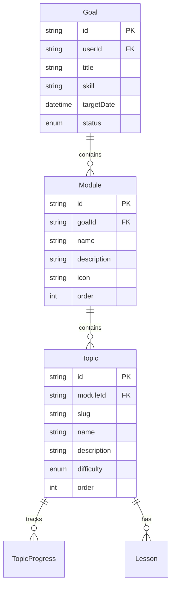

# Design Document: Hierarchical Course Structure

## Overview

Добавление иерархической структуры курсов: Goal → Module → Topic. Это позволит логически группировать темы по модулям, улучшить навигацию и отслеживание прогресса.

## Architecture

### Текущая структура
```
Goal
  └── Topic (8-15 тем напрямую)
```

### Новая структура
```
Goal (Курс)
  └── Module (Модуль/Раздел)
        └── Topic (Тема/Урок)
```

### Диаграмма связей



## Components and Interfaces

### 1. Database Schema (Prisma)

```prisma
model Module {
  id          String   @id @default(cuid())
  goalId      String
  goal        Goal     @relation(fields: [goalId], references: [id], onDelete: Cascade)
  
  name        String
  description String?
  icon        String   @default("📚")
  order       Int      @default(0)
  
  topics      Topic[]
  
  createdAt   DateTime @default(now())
  
  @@unique([goalId, order])
}

model Topic {
  // Изменение: goalId → moduleId
  moduleId    String
  module      Module   @relation(fields: [moduleId], references: [id], onDelete: Cascade)
  
  // Остальные поля без изменений
}

model Goal {
  // Добавляем связь с Module
  modules     Module[]
  
  // Удаляем прямую связь с Topic (теперь через Module)
}
```

### 2. API Interfaces

#### Генерация курса (POST /api/goals)

**Новый формат ответа AI:**
```typescript
interface GeneratedCourse {
  modules: {
    name: string;
    description: string;
    icon: string;
    order: number;
    topics: {
      slug: string;
      name: string;
      description: string;
      icon: string;
      difficulty: 'EASY' | 'MEDIUM' | 'HARD' | 'EXPERT';
      estimatedMinutes: number;
      order: number;
      prerequisites: string[];
    }[];
  }[];
}
```

#### Получение курса (GET /api/goals/:id)

**Ответ:**
```typescript
interface GoalWithModules {
  id: string;
  title: string;
  skill: string;
  modules: {
    id: string;
    name: string;
    description: string;
    icon: string;
    order: number;
    progress: number; // Вычисляемое поле
    topics: {
      id: string;
      name: string;
      order: number;
      progress: TopicProgress | null;
    }[];
  }[];
}
```

### 3. UI Components

#### ModuleList Component
```typescript
interface ModuleListProps {
  modules: Module[];
  onTopicClick: (topicId: string) => void;
}

// Отображает список модулей с collapsible секциями
// Показывает прогресс каждого модуля
// Нумерация: Module 1, Module 2...
```

#### ModuleCard Component
```typescript
interface ModuleCardProps {
  module: Module;
  isExpanded: boolean;
  onToggle: () => void;
  progress: number;
}

// Карточка модуля с заголовком, описанием, прогрессом
// При клике раскрывает/скрывает список тем
```

#### TopicItem Component
```typescript
interface TopicItemProps {
  topic: Topic;
  moduleOrder: number;
  onClick: () => void;
}

// Элемент темы внутри модуля
// Нумерация: 1.1, 1.2, 2.1, 2.2...
```

## Data Models

### Module Model

| Field | Type | Description |
|-------|------|-------------|
| id | string | Уникальный идентификатор |
| goalId | string | FK на Goal |
| name | string | Название модуля |
| description | string? | Описание модуля |
| icon | string | Эмодзи иконка |
| order | int | Порядковый номер (1, 2, 3...) |

### Updated Topic Model

| Field | Type | Change |
|-------|------|--------|
| moduleId | string | NEW: FK на Module (вместо goalId) |
| order | int | Порядок внутри модуля (1, 2, 3...) |

## Correctness Properties

*A property is a characteristic or behavior that should hold true across all valid executions of a system.*

### Property 1: Cascade Delete Integrity
*For any* Goal with Modules and Topics, when the Goal is deleted, all associated Modules and their Topics SHALL be deleted from the database.
**Validates: Requirements 1.4, 1.5**

### Property 2: Module Count Bounds
*For any* AI-generated course structure, the number of Modules SHALL be between 3 and 6 inclusive.
**Validates: Requirements 2.1**

### Property 3: Topic Count Per Module Bounds
*For any* AI-generated Module, the number of Topics SHALL be between 2 and 5 inclusive.
**Validates: Requirements 2.2**

### Property 4: Sequential Order Assignment
*For any* generated course, Module order values SHALL be sequential starting from 1, and Topic order values within each Module SHALL be sequential starting from 1.
**Validates: Requirements 2.3, 2.4**

### Property 5: Module Description Existence
*For any* AI-generated Module, the description field SHALL be non-empty.
**Validates: Requirements 2.7**

### Property 6: Progress Calculation Accuracy
*For any* Module with N total Topics and M completed Topics, the progress percentage SHALL equal (M / N) * 100.
**Validates: Requirements 4.1, 4.2**

### Property 7: Overall Course Progress Calculation
*For any* Goal, the overall progress SHALL equal (total completed topics across all modules / total topics across all modules) * 100.
**Validates: Requirements 4.4**

### Property 8: Migration Data Preservation
*For any* existing Goal with Topics, after migration all original Topics SHALL exist within a Module and all TopicProgress records SHALL be preserved.
**Validates: Requirements 5.2, 5.3**

### Property 9: API Response Ordering
*For any* API response containing course structure, Modules SHALL be sorted by order ascending, and Topics within each Module SHALL be sorted by order ascending.
**Validates: Requirements 6.4**

## Error Handling

| Error Case | Handling |
|------------|----------|
| AI fails to generate modules | Fallback to default 3-module structure |
| Module order conflict | Auto-increment order on conflict |
| Migration failure | Rollback transaction, log error |
| Invalid module count from AI | Validate and adjust to bounds (3-6) |

## Testing Strategy

### Unit Tests
- Module CRUD operations
- Progress calculation logic
- Order management utilities

### Property-Based Tests
- Module order uniqueness (Property 1)
- Topic order uniqueness within module (Property 2)
- Module count bounds (Property 4)
- Topic count per module bounds (Property 5)
- Progress calculation (Property 6)

### Integration Tests
- Course generation with modules
- Migration of existing data
- API endpoints with new structure

### E2E Tests
- Create course → verify module structure in UI
- Expand/collapse modules
- Progress tracking across modules
