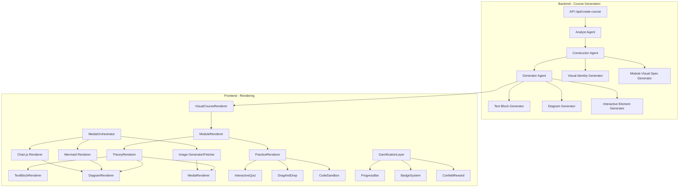

# Design Document: Visual Interactive Courses

## Overview

Расширение AI Study Agent для генерации визуально богатых, интерактивных образовательных курсов. Система добавляет слой визуальной идентичности, интерактивных компонентов, мультимедиа и геймификации поверх существующей архитектуры агентов (Analyst → Constructor → Generator).

Ключевые изменения:
1. **Расширение типов** — новые интерфейсы для визуальных спецификаций
2. **Модификация Constructor Agent** — генерация visual_spec для каждого модуля
3. **Модификация Generator Agent** — генерация text_blocks с визуальными элементами
4. **Новые React компоненты** — VisualCourseRenderer, MediaOrchestrator, InteractiveComponents
5. **Интеграция библиотек** — mermaid.js, chart.js, framer-motion, react-confetti

## Architecture



## Components and Interfaces

### 1. Extended Type Definitions (lib/agents/types.ts)

```typescript
// ═══════════════════════════════════════════════════════════════
// 🎨 VISUAL IDENTITY TYPES
// ═══════════════════════════════════════════════════════════════

export type ColorScheme = 'blue-gradient' | 'green-gradient' | 'purple-gradient' | 'orange-gradient'

export type VisualTheme = 'minimalist-illustrations' | 'data-driven-infographics' | 'animated-diagrams'

export type InteractivityLevel = 'high' | 'medium' | 'low'

export interface VisualIdentity {
  primaryColor: string        // e.g., "#4F46E5"
  gradient: string            // e.g., "linear-gradient(135deg, #667eea 0%, #764ba2 100%)"
  fontPairing: [string, string]  // e.g., ["Inter", "JetBrains Mono"]
  iconFamily: string          // e.g., "Lucide"
  colorScheme: ColorScheme
  visualTheme: VisualTheme
}

// ═══════════════════════════════════════════════════════════════
// 📊 MODULE VISUAL SPEC TYPES
// ═══════════════════════════════════════════════════════════════

export type PrimaryVisualType = 'diagram' | 'infographic' | 'timeline' | 'comparison_table' | 'flowchart'

export interface PrimaryVisual {
  type: PrimaryVisualType
  description: string         // Detailed description for generation
  mermaidCode?: string        // If type is diagram/flowchart
}

export interface SecondaryVisual {
  type: 'icon_set' | 'badge' | 'illustration'
  icons?: string[]            // Emoji or icon names
  purpose: string
}

export interface ModuleVisualSpec {
  heroImagePrompt: string     // Prompt for image generation
  colorScheme: {
    primary: string
    secondary: string
    accent: string
  }
  decorationElements: ('geometric_shape' | 'gradient_orb' | 'floating_icon')[]
  primaryVisual: PrimaryVisual
  secondaryVisuals: SecondaryVisual[]
}

// ═══════════════════════════════════════════════════════════════
// 📝 TEXT BLOCK TYPES
// ═══════════════════════════════════════════════════════════════

export type ContentType = 'theory' | 'example' | 'practice' | 'review'

export type AccompanyingVisualType = 'icon' | 'illustration' | 'photo' | 'diagram'

export interface AccompanyingVisual {
  type: AccompanyingVisualType
  description: string         // Search query or generation prompt
  iconName?: string           // For icon type
  mermaidCode?: string        // For diagram type
  chartConfig?: ChartConfig   // For data visualization
}

export type InteractiveElementType = 'toggle_detail' | 'flip_card' | 'scratch_to_reveal'

export interface TextBlockInteractive {
  type: InteractiveElementType
  content: string             // Hidden content to reveal
}

export interface TextBlock {
  text: string                // Max 150 words
  accompanyingVisual: AccompanyingVisual
  interactiveElement?: TextBlockInteractive
}

// ═══════════════════════════════════════════════════════════════
// 📈 DIAGRAM AND CHART TYPES
// ═══════════════════════════════════════════════════════════════

export type DiagramType = 'mermaid' | 'chartjs'

export interface MermaidDiagram {
  type: 'mermaid'
  code: string                // Mermaid syntax
  interactive: boolean
}

export interface ChartConfig {
  type: 'bar_chart' | 'pie_chart' | 'line_graph' | 'mind_map'
  data: {
    labels: string[]
    datasets: Array<{
      label: string
      data: number[]
      backgroundColor?: string[]
    }>
  }
  interactive: boolean
}

export type DiagramConfig = MermaidDiagram | ChartConfig

// ═══════════════════════════════════════════════════════════════
// 🎮 INTERACTIVE COMPONENT TYPES
// ═══════════════════════════════════════════════════════════════

export type InteractiveComponentType = 
  | 'drag_and_drop' 
  | 'code_sandbox' 
  | 'quiz_with_feedback' 
  | 'simulation' 
  | 'progress_checklist'

export type DragDropDifficulty = 'matching' | 'ordering' | 'fill_blank'

export type RewardVisual = 'confetti' | 'badge' | 'progress_bar'

export interface InteractiveComponentConfig {
  type: InteractiveComponentType
  difficulty?: DragDropDifficulty
  rewardVisual: RewardVisual
  hintsAvailable: number
  data: Record<string, unknown>
}

// ═══════════════════════════════════════════════════════════════
// 🎬 MULTIMEDIA TYPES
// ═══════════════════════════════════════════════════════════════

export interface ImageGenerationPrompt {
  style: string               // e.g., "educational illustration flat design"
  subject: string
  action: string
  detailLevel: string         // e.g., "for mobile screens"
}

export interface VideoSource {
  platform: 'youtube' | 'codepen' | 'observable'
  searchQuery: string
  durationPreference: string  // e.g., "2-5 minutes"
  hasCaptions: boolean
  aspectRatio: '16:9' | '1:1' | '4:3'
}

export interface MultimediaSpec {
  imagePrompts: ImageGenerationPrompt[]
  videoSources: VideoSource[]
  diagrams: DiagramConfig[]
  embeds: VideoSource[]
}

// ═══════════════════════════════════════════════════════════════
// 🏆 GAMIFICATION TYPES
// ═══════════════════════════════════════════════════════════════

export interface Checkpoint {
  title: string
  emoji: string
  rewardText: string
}

export type ProgressVisualizationType = 'progress_bar' | 'pie_chart' | 'experience_points'

export interface ProgressVisualization {
  type: ProgressVisualizationType
  maxValue: number
  currentValue: number
}

export interface GamificationSpec {
  checkpoints: Checkpoint[]
  progressVisualization: ProgressVisualization
  levelBadges: Array<{
    level: number
    emoji: string
    title: string
  }>
}

// ═══════════════════════════════════════════════════════════════
// 📦 EXTENDED COURSE STRUCTURE
// ═══════════════════════════════════════════════════════════════

export interface VisualCourseMetadata {
  visualIdentity: VisualIdentity
  interactivityLevel: InteractivityLevel
}

export interface VisualSection {
  contentType: ContentType
  textBlocks: TextBlock[]
  multimedia: MultimediaSpec
  gamification: GamificationSpec
  interactiveComponent?: InteractiveComponentConfig
}

export interface VisualModule extends CourseModule {
  visualSpec: ModuleVisualSpec
  sections: VisualSection[]
}

export interface VisualCourseStructure extends CourseStructure {
  metadata: CourseStructure['metadata'] & VisualCourseMetadata
  modules: VisualModule[]
}
```

### 2. Visual Identity Generator (lib/agents/visual-identity.ts)

```typescript
/**
 * Generate visual identity based on topic type and difficulty
 */
export function generateVisualIdentity(
  topicType: TopicType,
  difficulty: DifficultyLevel
): VisualIdentity {
  const colorSchemes: Record<TopicType, ColorScheme> = {
    programming: 'blue-gradient',
    technical: 'blue-gradient',
    scientific: 'green-gradient',
    creative: 'purple-gradient',
    humanities: 'purple-gradient',
    business: 'orange-gradient',
    practical: 'orange-gradient'
  }
  
  const visualThemes: Record<DifficultyLevel, VisualTheme> = {
    beginner: 'minimalist-illustrations',
    intermediate: 'data-driven-infographics',
    advanced: 'animated-diagrams',
    expert: 'animated-diagrams'
  }
  
  const colorPalettes: Record<ColorScheme, { primary: string; gradient: string }> = {
    'blue-gradient': {
      primary: '#4F46E5',
      gradient: 'linear-gradient(135deg, #667eea 0%, #764ba2 100%)'
    },
    'green-gradient': {
      primary: '#10B981',
      gradient: 'linear-gradient(135deg, #34d399 0%, #059669 100%)'
    },
    'purple-gradient': {
      primary: '#8B5CF6',
      gradient: 'linear-gradient(135deg, #a78bfa 0%, #7c3aed 100%)'
    },
    'orange-gradient': {
      primary: '#F59E0B',
      gradient: 'linear-gradient(135deg, #fbbf24 0%, #d97706 100%)'
    }
  }
  
  const scheme = colorSchemes[topicType]
  const palette = colorPalettes[scheme]
  
  return {
    primaryColor: palette.primary,
    gradient: palette.gradient,
    fontPairing: ['Inter', 'JetBrains Mono'],
    iconFamily: 'Lucide',
    colorScheme: scheme,
    visualTheme: visualThemes[difficulty]
  }
}
```

### 3. Module Visual Spec Generator (lib/agents/visual-spec.ts)

```typescript
/**
 * Generate visual specification for a module
 */
export async function generateModuleVisualSpec(
  module: CourseModule,
  visualIdentity: VisualIdentity,
  topicType: TopicType
): Promise<ModuleVisualSpec> {
  const systemPrompt = `Generate visual specifications for an educational module.
Return JSON with heroImagePrompt, colorScheme, decorationElements, primaryVisual, secondaryVisuals.`

  const userPrompt = `Module: ${module.name}
Description: ${module.description}
Topic Type: ${topicType}
Visual Theme: ${visualIdentity.visualTheme}

Generate visual spec with:
1. heroImagePrompt: "educational illustration flat design" style prompt
2. colorScheme: primary, secondary, accent colors (hex)
3. decorationElements: array of geometric_shape, gradient_orb, floating_icon
4. primaryVisual: type (diagram/infographic/timeline/comparison_table/flowchart) + description
5. secondaryVisuals: icon_set with relevant emojis`

  const { data } = await callLLMJson<ModuleVisualSpec>(systemPrompt, userPrompt)
  return data
}
```

### 4. Text Block Generator (lib/agents/text-blocks.ts)

```typescript
/**
 * Split theory into text blocks with visual elements
 */
export async function generateTextBlocks(
  theoryMarkdown: string,
  topicType: TopicType,
  visualTheme: VisualTheme
): Promise<TextBlock[]> {
  const systemPrompt = `Split educational content into text blocks (max 150 words each).
Each block needs an accompanying visual element.

For definitions: use icon type
For examples: use illustration or photo type
For data: use diagram type with mermaid code
For algorithms: use diagram type with flowchart

Return JSON array of TextBlock objects.`

  const userPrompt = `Content to split:
${theoryMarkdown}

Topic type: ${topicType}
Visual theme: ${visualTheme}

Generate text blocks with accompanying visuals.`

  const { data } = await callLLMJson<{ blocks: TextBlock[] }>(systemPrompt, userPrompt)
  return data.blocks
}
```

### 5. React Components

#### VisualCourseRenderer (components/course/VisualCourseRenderer.tsx)

```typescript
interface VisualCourseRendererProps {
  courseData: VisualCourseStructure
  userProgress: UserProgress
  onProgressUpdate: (progress: UserProgress) => void
}

export const VisualCourseRenderer: React.FC<VisualCourseRendererProps> = ({
  courseData,
  userProgress,
  onProgressUpdate
}) => {
  // Apply visual identity CSS variables
  // Render modules with visual specs
  // Handle gamification state
}
```

#### MediaOrchestrator (components/media/MediaOrchestrator.tsx)

```typescript
interface MediaOrchestratorProps {
  visual: AccompanyingVisual
  fallbackQuery?: string
}

export const MediaOrchestrator: React.FC<MediaOrchestratorProps> = ({
  visual,
  fallbackQuery
}) => {
  // If image_prompt → generate via placeholder/Unsplash
  // If diagram → render mermaid
  // If chart → render chart.js
}
```

#### InteractiveComponents (components/interactive/*)

- `DragAndDrop.tsx` — drag-and-drop matching/ordering
- `QuizWithFeedback.tsx` — quiz with instant feedback
- `CodeSandbox.tsx` — Monaco editor with Pyodide
- `ProgressChecklist.tsx` — interactive checklist
- `FlipCard.tsx` — flip card reveal
- `ScratchToReveal.tsx` — scratch card effect

#### GamificationLayer (components/gamification/*)

- `ProgressBar.tsx` — animated progress bar
- `BadgeSystem.tsx` — badge display and unlock
- `ConfettiReward.tsx` — confetti animation on completion
- `LevelIndicator.tsx` — current level display

## Data Models

### Extended API Response

```typescript
interface VisualCourseResponse {
  success: boolean
  data: {
    id: string
    title: string
    // ... existing fields ...
    
    // NEW: Visual metadata
    metadata: {
      visualIdentity: VisualIdentity
      interactivityLevel: InteractivityLevel
      // ... existing metadata ...
    }
    
    // NEW: Visual modules
    modules: Array<{
      // ... existing module fields ...
      
      visualSpec: ModuleVisualSpec
      sections: VisualSection[]
    }>
  }
}
```

### Media Cache Schema (Supabase)

```sql
CREATE TABLE media_cache (
  id UUID PRIMARY KEY DEFAULT gen_random_uuid(),
  prompt_hash VARCHAR(64) UNIQUE NOT NULL,
  media_type VARCHAR(20) NOT NULL, -- 'image', 'diagram', 'chart'
  content_url TEXT,
  content_data JSONB,
  created_at TIMESTAMP DEFAULT NOW(),
  expires_at TIMESTAMP DEFAULT NOW() + INTERVAL '30 days',
  hit_count INTEGER DEFAULT 0
);

CREATE INDEX idx_media_cache_hash ON media_cache(prompt_hash);
CREATE INDEX idx_media_cache_expires ON media_cache(expires_at);
```


## Correctness Properties

*A property is a characteristic or behavior that should hold true across all valid executions of a system—essentially, a formal statement about what the system should do. Properties serve as the bridge between human-readable specifications and machine-verifiable correctness guarantees.*

Based on the prework analysis, the following properties have been consolidated to eliminate redundancy and provide comprehensive coverage:

### Property 1: Visual Identity Generation Correctness

*For any* TopicType and DifficultyLevel combination, the generated VisualIdentity SHALL:
- Have colorScheme matching the TopicType mapping (programming/technical → blue-gradient, scientific → green-gradient, creative/humanities → purple-gradient, business/practical → orange-gradient)
- Have visualTheme matching the DifficultyLevel mapping (beginner → minimalist-illustrations, intermediate → data-driven-infographics, advanced/expert → animated-diagrams)
- Contain all required fields: primaryColor (valid hex), gradient (valid CSS gradient), fontPairing (array of 2 strings), iconFamily (non-empty string)

**Validates: Requirements 1.1, 1.2, 1.3, 1.4**

### Property 2: Module Visual Spec Completeness

*For any* generated VisualModule, the visualSpec SHALL:
- Have heroImagePrompt as a non-empty string
- Have colorScheme with primary, secondary, and accent as valid hex colors
- Have primaryVisual with type being one of: diagram, infographic, timeline, comparison_table, flowchart
- Have secondaryVisuals as an array (may be empty)

**Validates: Requirements 2.1, 2.2, 2.3**

### Property 3: Interactive Component Validity

*For any* generated InteractiveComponent:
- type SHALL be one of: drag_and_drop, code_sandbox, quiz_with_feedback, simulation, progress_checklist
- IF type is drag_and_drop, THEN difficulty SHALL be one of: matching, ordering, fill_blank
- rewardVisual SHALL be one of: confetti, badge, progress_bar
- hintsAvailable SHALL be an integer between 0 and 3 inclusive

**Validates: Requirements 3.1, 3.2, 3.3, 3.4, 3.5**

### Property 4: Text Block Structure Correctness

*For any* generated TextBlock:
- text SHALL contain at most 150 words (split by whitespace)
- accompanyingVisual SHALL exist with type being one of: icon, illustration, photo, diagram
- accompanyingVisual.description SHALL be a non-empty string

**Validates: Requirements 4.1, 4.2**

### Property 5: Diagram Configuration Validity

*For any* MermaidDiagram:
- code SHALL be a non-empty string containing valid mermaid syntax (starts with graph, flowchart, sequenceDiagram, classDiagram, etc.)
- interactive SHALL be a boolean

*For any* ChartConfig:
- type SHALL be one of: bar_chart, pie_chart, line_graph, mind_map
- data.labels SHALL be a non-empty array of strings
- data.datasets SHALL be a non-empty array with each dataset having label and data fields

**Validates: Requirements 5.1, 5.2**

### Property 6: Multimedia Spec Completeness

*For any* generated MultimediaSpec:
- videoSources SHALL be an array where each item has: searchQuery (non-empty string), durationPreference (string), hasCaptions (boolean)
- imagePrompts SHALL be an array where each item has: style, subject, action, detailLevel (all non-empty strings)
- embeds SHALL be an array where each item has platform being one of: youtube, codepen, observable

**Validates: Requirements 6.1, 6.2, 6.4, 6.6**

### Property 7: Gamification Spec Validity

*For any* generated GamificationSpec:
- checkpoints SHALL be an array where each item has: title (non-empty string), emoji (non-empty string), rewardText (non-empty string)
- progressVisualization SHALL have: type being one of progress_bar, pie_chart, experience_points
- progressVisualization.maxValue SHALL be a positive number
- progressVisualization.currentValue SHALL be >= 0 AND <= maxValue
- levelBadges SHALL be an array where each item has: level (positive integer), emoji (non-empty string), title (non-empty string)

**Validates: Requirements 7.1, 7.2, 7.3, 7.4, 7.6**

### Property 8: API Response Structure Correctness

*For any* successful API response from /api/create-course with visual features enabled:
- data.metadata.visualIdentity SHALL exist and satisfy Property 1
- data.metadata.interactivityLevel SHALL be one of: high, medium, low
- FOR ALL modules in data.modules: module.visualSpec SHALL exist and satisfy Property 2
- FOR ALL sections in any module: section.contentType SHALL be one of: theory, example, practice, review
- FOR ALL textBlocks in any section: textBlock SHALL satisfy Property 4
- FOR ALL sections: section.multimedia SHALL exist
- FOR ALL sections: section.gamification SHALL exist

**Validates: Requirements 8.1, 8.2, 8.3, 8.4, 8.5, 8.6, 8.7**

### Property 9: Media Source Selection Logic

*For any* AccompanyingVisual passed to MediaOrchestrator:
- IF type is 'diagram' AND mermaidCode exists, THEN render using mermaid.js
- IF type is 'diagram' AND chartConfig exists, THEN render using chart.js
- IF type is 'icon', THEN use Lucide icon by iconName
- IF type is 'illustration' OR 'photo', THEN search Unsplash by description

**Validates: Requirements 9.5**

### Property 10: Media Cache Round-Trip Correctness

*For any* media element cached in the system:
- Caching then retrieving by the same prompt_hash SHALL return identical content
- expires_at SHALL be approximately 30 days after created_at (within 1 hour tolerance)
- Each cache hit SHALL increment hit_count by exactly 1
- Hash function SHALL be deterministic: same prompt always produces same hash

**Validates: Requirements 10.1, 10.2, 10.3, 10.4, 10.5, 10.6**

## Error Handling

### Visual Identity Generation Errors

| Error Condition | Handling Strategy |
|-----------------|-------------------|
| Unknown TopicType | Default to 'blue-gradient' color scheme |
| Unknown DifficultyLevel | Default to 'minimalist-illustrations' theme |
| Invalid hex color in palette | Use fallback color (#4F46E5) |

### Module Visual Spec Generation Errors

| Error Condition | Handling Strategy |
|-----------------|-------------------|
| LLM fails to generate visual spec | Use template-based fallback spec |
| Invalid JSON from LLM | Retry once, then use fallback |
| Missing required fields | Fill with sensible defaults |

### Text Block Generation Errors

| Error Condition | Handling Strategy |
|-----------------|-------------------|
| Text block exceeds 150 words | Split into multiple blocks |
| LLM fails to assign visual | Use 'icon' type with generic description |
| Invalid visual type | Default to 'icon' |

### Diagram Rendering Errors

| Error Condition | Handling Strategy |
|-----------------|-------------------|
| Invalid mermaid syntax | Show error message with raw code |
| Chart.js data validation fails | Show placeholder with error |
| Diagram too complex to render | Simplify or show static image |

### Media Orchestration Errors

| Error Condition | Handling Strategy |
|-----------------|-------------------|
| Unsplash API unavailable | Use placeholder image |
| Image generation fails | Fall back to Unsplash search |
| YouTube embed blocked | Show link instead of embed |
| Cache miss | Generate/fetch and cache |

### Gamification Errors

| Error Condition | Handling Strategy |
|-----------------|-------------------|
| Progress exceeds maxValue | Cap at maxValue |
| Invalid checkpoint data | Skip checkpoint, log warning |
| Confetti animation fails | Silently degrade to no animation |

## Testing Strategy

### Dual Testing Approach

This feature requires both unit tests and property-based tests:

- **Unit tests**: Verify specific examples, edge cases, and error conditions
- **Property tests**: Verify universal properties across all inputs using fast-check

### Property-Based Testing Configuration

- **Library**: fast-check (TypeScript PBT library)
- **Minimum iterations**: 100 per property test
- **Tag format**: `Feature: visual-interactive-courses, Property N: {property_text}`

### Test File Structure

```
ai-study-agent-main/
├── lib/
│   └── agents/
│       └── __tests__/
│           ├── visual-identity.test.ts      # Property 1
│           ├── visual-spec.test.ts          # Property 2
│           ├── interactive-components.test.ts # Property 3
│           ├── text-blocks.test.ts          # Property 4
│           ├── diagrams.test.ts             # Property 5
│           ├── multimedia.test.ts           # Property 6
│           ├── gamification.test.ts         # Property 7
│           └── api-response.test.ts         # Property 8
├── components/
│   └── media/
│       └── __tests__/
│           └── media-orchestrator.test.ts   # Property 9
└── lib/
    └── __tests__/
        └── media-cache.test.ts              # Property 10
```

### Generator Strategies

For property-based tests, we need smart generators:

```typescript
// TopicType generator
const topicTypeArb = fc.constantFrom(
  'programming', 'scientific', 'creative', 
  'practical', 'business', 'humanities', 'technical'
)

// DifficultyLevel generator
const difficultyArb = fc.constantFrom(
  'beginner', 'intermediate', 'advanced', 'expert'
)

// TextBlock generator (constrained to 150 words)
const textBlockArb = fc.record({
  text: fc.array(fc.lorem({ mode: 'words' }), { minLength: 1, maxLength: 150 })
    .map(words => words.join(' ')),
  accompanyingVisual: fc.record({
    type: fc.constantFrom('icon', 'illustration', 'photo', 'diagram'),
    description: fc.string({ minLength: 1, maxLength: 200 })
  })
})

// VisualIdentity generator
const visualIdentityArb = fc.record({
  primaryColor: fc.hexaString({ minLength: 6, maxLength: 6 }).map(s => `#${s}`),
  gradient: fc.constant('linear-gradient(135deg, #667eea 0%, #764ba2 100%)'),
  fontPairing: fc.tuple(fc.string(), fc.string()),
  iconFamily: fc.string({ minLength: 1 }),
  colorScheme: fc.constantFrom('blue-gradient', 'green-gradient', 'purple-gradient', 'orange-gradient'),
  visualTheme: fc.constantFrom('minimalist-illustrations', 'data-driven-infographics', 'animated-diagrams')
})
```

### Unit Test Examples

```typescript
// Example unit test for visual identity
describe('generateVisualIdentity', () => {
  it('returns blue-gradient for programming topics', () => {
    const result = generateVisualIdentity('programming', 'beginner')
    expect(result.colorScheme).toBe('blue-gradient')
  })
  
  it('returns minimalist-illustrations for beginner difficulty', () => {
    const result = generateVisualIdentity('programming', 'beginner')
    expect(result.visualTheme).toBe('minimalist-illustrations')
  })
})
```

### Integration Test Points

1. **End-to-end course generation** with visual features enabled
2. **API response validation** against JSON schema
3. **Component rendering** with various visual specs
4. **Cache hit/miss scenarios** for media elements

### Performance Considerations

- Text block splitting should complete in < 100ms for typical theory content
- Visual spec generation should not add > 2s to course generation time
- Media cache lookups should complete in < 50ms
- Mermaid diagram rendering should complete in < 500ms

